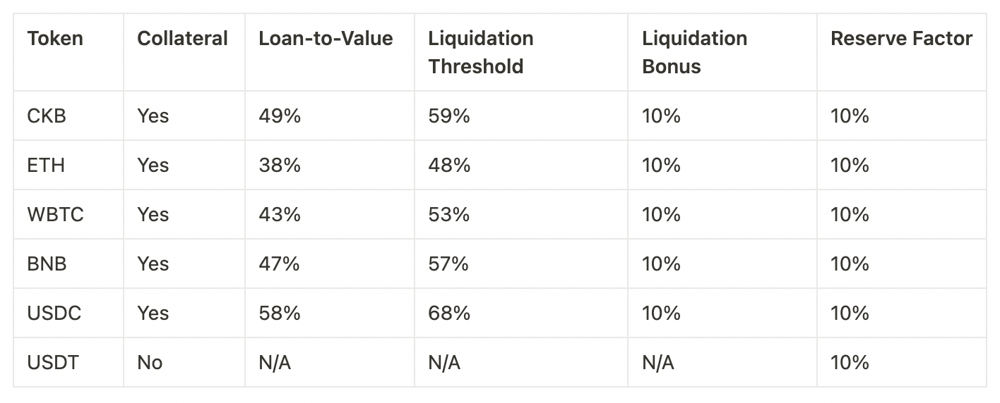

# Hadouken Lend

On the lending page, you will see a list of assets that you can borrow and lend on the platform.

 (1).png>)

Navigate to the dashboard and you will see your deposits, and - if applicable - any outstanding loans.

.png>)

To open a loan, you first need to deposit collateral. So head over to the deposits page, and let's deposit some CKB.

.png>)

Confirm the transaction using MetaMask, and wait for confirmation on the blockchain.

.png>)

Now head over to the borrow page and view what amounts are available to borrow.

.png>)

Choosing WBTC, you can initiate a borrow based on your amount of posted collateral.

 (2).png>)

Click borrow and confirm the MetaMask prompts. If you navigate back to the dashboard, you should see your open borrows and deposits.

.png>)

To repay, click repay, choose the amount you wish to repay (ideally click max) and submit the transaction. Confirm it on MetaMask like any other transaction and you're all set.

